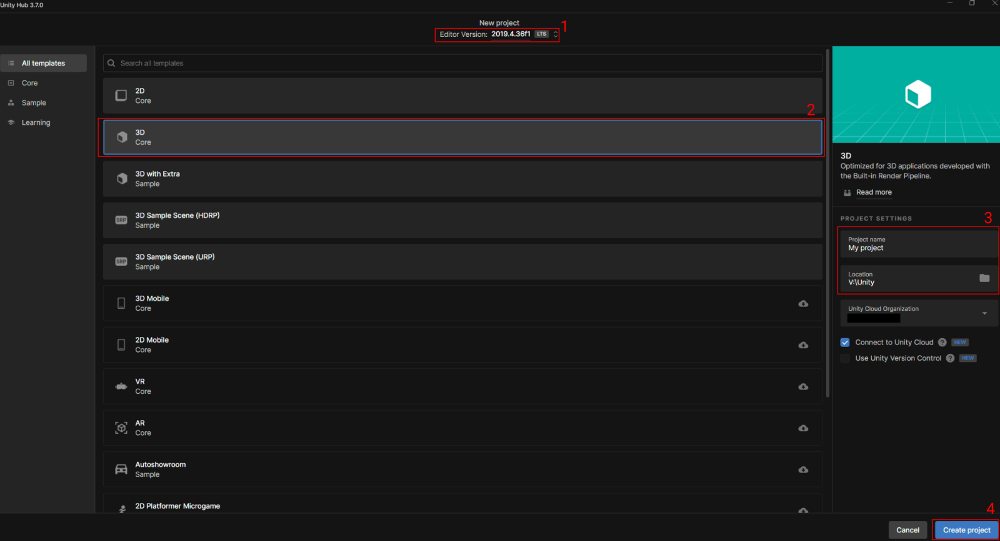
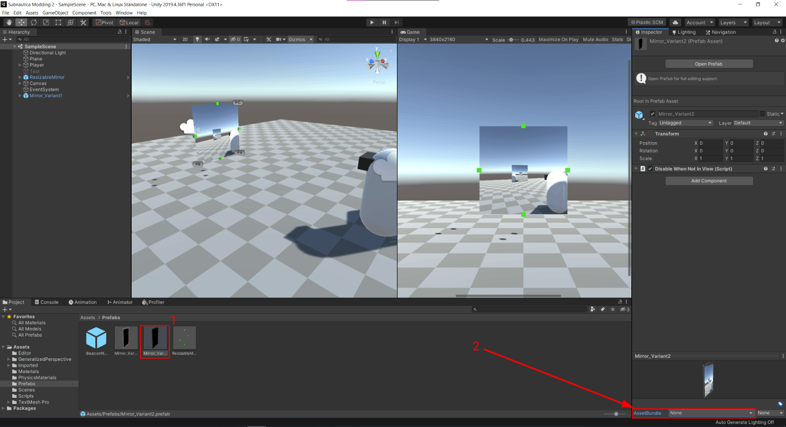

# Asset Bundles Guide

This guide will show you how to convert and package custom files into the Asset Bundle format, which can easily be loaded by your mods.  
You will learn how to take a file exported from a 3D modeling program (such as Blender) and turn it into a GameObject which can then be loaded by your mod.  

Basic modding knowledge is required for this tutorial.
Here are some things you will need to know:
- Basic modding and C# knowledge
- Basic knowledge of how to navigate the Unity game engine interface

The first thing you will need to do (Assuming you have a model already) is download the Unity Hub.  
This is where you will get the Unity version you need to use to export your asset bundle.

The version Subnautica uses is 2019.4.36.  
This is the same on Below Zero.  

Here are the download links you will need:  
- Unity hub: [https://unity.com/download](https://unity.com/download)
- Unity version archive: [https://unity.com/releases/editor/archive](https://unity.com/releases/editor/archive)  

## Creating the Unity Project

> [!NOTE]
> It's not necessary to make a new Unity project for each mod (individual projects are actually quite large), but for this tutorial we will be making a fresh project.

Once you've installed both, open Unity hub and click "New Project" from the top right.  
Next, follow these steps:
1. Verify your Unity version is correct.
2. Select 3D core from the template list.
3. Configure your project name and location.
4. Click on "Create Project."


> [!NOTE]
> If you get the error "<font color="red">Failed to resolve project template</font>", follow these steps:
> 1. Locate where your editor is. 
> You can do that by opening Unity Hub, going to Installs, and then right clicking on the version in question and clicking "Show in Explorer."
> 2. Go to ``Editor\Data\Resources\PackageManager\ProjectTemplates``. You will find two files, ``manifest.json`` and ``UnityLicense.json``. Delete them both.
> 3. Kill Unity Hub in your task manager and open it again.
> 
> You should now be able to create your project!

The Unity editor will now open. This may take a while.  

## Installing the Asset Bundle Browser

Once the editor has opened, click on ``Window`` at the top of the editor, and then click ``Package Manager``.  
Click on the dropdown at the top left and select ``Unity Registry`` if not on it already.  
Search for "Asset Bundle Browser" and install it.

## Creating the Prefab

Once the editor is open, drag your model from your file manager into the Scene window.
You can either click on your model in the scene window or in the hierarchy on the left to select it.

If you need to, you may place your model under an empty GameObject (in the editor, GameObject -> Create Empty) to apply any necessary model scaling and to separate it from any other children.   Constructable prefabs (aka base modules) specifically REQUIRE the model object to be separate from the entire prefab as an individual child object.

Next, drag your model from the hierarchy on the left into the ``Project`` section at the bottom.  
This will create what is called a ``Prefab``. It can be instantiated (created/spawned) multiple times, but they are all copies of the original.

## Editing the Prefab and Adding Components

To edit the prefab, double click on it in the ``Project`` window.  
You can add components to the prefab by clicking "Add Component" in the inspector on the right.  
One example of a component is a ``Rigidbody``, which can apply physics to your Prefab.  
Keep in mind, however, that every (non-kinematic) Rigidbody requires a WorldForces component to work properly, which must be added either through code or with a tool such as Thunderkit.  
Any components you add will be included in the AssetBundle.

> [!CAUTION]
> You <font color="red">**should not**</font>, however, add scripts to your prefab that you made in the editor!  
> The AssetBundle will not link them to the scripts in your modding project and you will get errors.  

## Assigning the Asset Bundle

Next, follow these steps to assign an asset bundle to your prefab.
1. After all your prefab configuration is done, select it in the ``Project`` window.
2. Click on on "Asset Bundle" in the bottom right of the Inspector.  
Here you can either assign your prefab to an existing AssetBundle or create a new one.  



## Exporting the Asset Bundle

Once you've assigned your AssetBundle, open the Asset Bundle Browser (Window → AssetBundleBrowser at the top of the editor).  
Here you can see all the assets that will be put into your AssetBundle.  


Click on the build tab, and change the ``Build Target`` to "Standalone Windows" if it isn't already.  
You can also configure the ``Output Path`` of the build.  
After all that is set, click ``Build``.

Once your AssetBundle is built, move the built file to the location of your mod in the Plugins folder.  
It's generally prefered to put them inside a folder named "Assets", but that isn't necessary.  


Now the hard part is done! All you need to do is load it within your mod's code.  

## Referencing the AssetBundleModule

> [!WARNING]
> If you are using the Nautilus template or have installed the Nautilus NuGet package, skip this step.
> The template and package include all the ``UnityEngine`` references already, so referencing them twice may cause errors.

The first thing you will need to do is add the ``UnityEngine.AssetBundleModule.dll`` as a reference in your IDE (Assuming you don't already have it referenced).  

## [Visual Studio 2022](#tab/vs)
1. Open your project tab and right click on References.
2. Select ``Add Reference``.
3. Click Browse, and navigate to ``[Game Location]/Subnautica_Data/Managed``, and add ``UnityEngine.AssetBundleModule.dll`` as a reference.  
4. Click ``Ok`` to close the window.  


## [JetBrains Rider](#tab/rider)
1. Right click on your project, and navigate to ``Add → Add Reference``.
2. Click ``Add From``.
3. Navigate to ``[Game Location]/Subnautica_Data/Managed``, and add ``UnityEngine.AssetBundleModule.dll`` as a reference.
4. Click ``Ok`` to close the window.

## [.NET CLI](#tab/cli)
1. Open a terminal.
2. Enter ``dotnet add [Path to your project file (.csproj)] reference [Subnautica Location]/Subnautica_Data/Managed/UnityEngine.AssetBundleModule.dll``.
---

## Using the Asset Bundle

> [!NOTE]
> The way you load assets from the Asset Bundle will depend on if you're using Nautilus or not.

# [Not using Nautilus](#tab/noNautilus)

Here's some example code of how you can load in your prefab:

```csharp
using BepInEx;
using System.IO;
using System.Reflection;
using UnityEngine;

namespace Examples
{
    internal class AssetBundles : BaseUnityPlugin
    {
        // Usually this is done in your Plugin script but technically you can do it wherever
        public static AssetBundle MyAssetBundle { get; private set; }

        // This gets the path to the "Assets" folder inside my plugin folder
        // If you don't have an assets folder you can replace "AssetsFolderPath" with Assembly.GetExecutingAssembly().Location
        // That just gets the path to the .dll of the mod
        public static string AssetsFolderPath = Path.Combine(Path.GetDirectoryName(Assembly.GetExecutingAssembly().Location), "Assets");

        private void Awake()
        {
            // Keep in mind that the assetbundle can only be open in one place at a time, so keep a reference
            MyAssetBundle = AssetBundle.LoadFromFile(Path.Combine(AssetsFolderPath, "myAssetBundle"));

            // This name needs to be the exact same name as the prefab you put in the bundle
            GameObject mirrorVariant1 = AssetBundle.LoadAsset<GameObject>("myGameObject");
        }
    }
}
```

# [Using Nautilus](#tab/nautilus)

Here is one example of how to load in the asset bundle using the Nautilus ``AssetBundleLoadingUtils`` class:

```csharp
using BepInEx;
using System.IO;
using System.Reflection;
using UnityEngine;

namespace Examples
{
    internal class AssetBundles : BaseUnityPlugin
    {
        // Usually this is done in your Plugin script but technically you can do it wherever
        public static AssetBundle MyAssetBundle { get; private set; }

        private void Awake()
        {
            // Keep in mind that the assetbundle can only be open in one place at a time, so keep a reference
            // This method assumes you have a folder named "Assets" in your mod's plugin folder
            // The second parameter needs to be the name of the asset bundle file (Usually they don't have file extensions)
            MyAssetBundle = AssetBundleLoadingUtils.LoadFromAssetsFolder(Assembly.GetExecutingAssembly(), "myAssetBundle")

            // This name needs to be the exact same name as the prefab you put in the bundle
            GameObject mirrorVariant1 = MyAssetBundle.LoadAsset<GameObject>("myGameObject");
        }
    }
}
```
---

## Using the Imported Asset

And just like that you have your prefab in your code!  
To use a GameObject from your Asset Bundle in a Nautilus prefab, simply write
```csharp
myCustomPrefab.SetGameObject(myAssetBundleGO);
```
Instead of using a prefab template.  
<br>
For more complicated prefabs (such as buildables), you can create your own method that loads the prefab from the asset bundle and applies extensive modifications to it.  
You can *also* apply changes to the prefab directly.

E.g., ``myAssetBundleGO.AddComponent<WorldForces>();``

Here is one example of how to use an Asset Bundle GameObject in a custom prefab:
```csharp
using Nautilus.Assets;
using Nautilus.Assets.Gadgets;
using Nautilus.Crafting;
using Nautilus.Utility;
using UnityEngine;
using Ingredient = CraftData.Ingredient;

namespace ExamplePrefab
{
    internal static class MyCoolPrefab
    {
        public static PrefabInfo MyPrefabInfo { get; private set; }

        public static void Patch()
        {
            PrefabInfo prefabInfo = PrefabInfo.WithTechType("MyCoolPrefab", "My Cool Prefab", "Pretty cool, right!")
                .WithIcon(SpriteManager.Get(TechType.Titanium));
            // Just using the Titanium sprite as a placeholder

            // Cache the tech type for use in other places
            MyPrefabInfo = prefabInfo;

            var prefab = new CustomPrefab(prefabInfo);

            // Create the recipe
            RecipeData recipe = new RecipeData
            {
                craftAmount = 1,
                Ingredients =
                {
                    new Ingredient(TechType.Titanium, 2),
                    new Ingredient(TechType.CopperWire, 2),
                },
            };

            // Set the prefab GamrObject to the result of the GetAssetBundlePrefab method
            prefab.SetGameObject(GetAssetBundlePrefab());

            // Using the Seaglide as a placeholder unlock
            prefab.SetUnlock(TechType.Seaglide);
            
            // Set the recipe
            prefab.SetRecipe(recipe)
                .WithCraftingTime(6f);

            // Add the prefab to the Miscellaneous tab of the blueprints in the PDA
            prefab.SetPdaGroupCategory(TechGroup.Miscellaneous, TechCategory.Misc);

            // Register the prefab to the Nautilus prefab database
            prefab.Register();
        }

        private static GameObject GetAssetBundlePrefab()
        {
            GameObject myCoolPrefab = assetBundle.LoadAsset<GameObject>("myCoolPrefab");

            // The classID is the same as the one we put into the PrefabInfo.WithTechType up above
            // The LargeWorldEntity.CellLevel determines how far away the object will be loaded from the player
            PrefabUtils.AddBasicComponents(myCoolPrefab, MyPrefabInfo.ClassID, MyPrefabInfo.TechType, LargeWorldEntity.CellLevel.Medium);

            // Makes the GameObject have the correct shaders
            // You can use the optional inputs here to change the look of your object
            MaterialUtils.ApplySNShaders(myCoolPrefab);

            // Return the GameObject with all the components added
            return myCoolPrefab;
        }
    }
}
```

There are endless possibilities with Asset Bundles, so don't hesitate to experiment!  
If you have more questions about Asset Bundles, feel free to ask in the modding channels of the modding Discord.