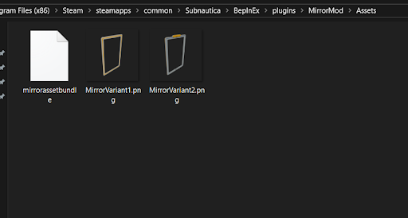
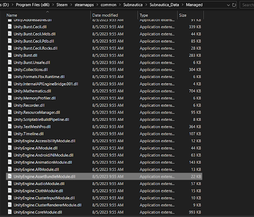

# Asset Bundles Guide

This guide will show you how to take a 3d model file from a program such as Blender, and turn it into a GameObject which can then be used in your mod.

Basic modding knowledge is required for this tutorial.
Here are some things you will need to know:
- Basic modding and C# knowledge
- Basic knowledge of how to navigate the Unity game engine interface

The first thing you will need to do (Assuming you have a model already) is download the Unity Hub.
This is where you will get the Unity version you need to use to export your asset bundle.

The version Subnautica uses is 2019.4.36 for SN1, as well as Below Zero.
If you can't find that exact version, just get the one closest to it.

Here are the download links you will need:  
- Unity hub: [https://unity.com/download](https://unity.com/download)
- Unity version archive: [https://unity.com/releases/editor/archive](https://unity.com/releases/editor/archive)

Once you've installed both, open Unity hub and click "New Project" from the top right.
Once there, select 3D Core, choose your project name and then click "Create Project".  


If you get the error "Failed to resolve project template", follow these steps:
1. Locate where your editor is. 
You can do that by opening Unity Hub, going to Installs then right clicking on the version in question and clicking on "Show in Explorer"
2. Go to ``Editor\Data\Resources\PackageManager\ProjectTemplates``. You will find a ``manifest.json`` and ``UnityLicense.json`` files, delete them both.
3. Kill Unity Hub in your task manager and open it again.

You should now be able to create your project!

The Unity editor will now open. This may take a while.  
Once the editor is open, drag your model from your file manager into the Scene window

You can either click on your model in the scene window or in the hierarchy on the left to select it and use transformations on it

Next, click on ``Window`` at the top of the Unity editor, and then click ``Package Manager``.  
Click on the dropdown at the top left and select ``Unity Registry`` if not on it already.  
Search for "Asset Bundle Browser" and install it.

Next, drag your model from the hierarchy on the left into the ``Assets`` section at the bottom.  
This will create what is called a Prefab. It can be instantiated (created/spawned) multiple times but they are all copies of the original.

To edit the prefab, double click on it in the ``Assets`` window.  
You can add components to the prefab by clicking "Add Component" in the inspector on the right.  
One example of a component is a ``RigidBody``, which can apply physics to your Prefab.  
Any components you add will be included in the AssetBundle.

You **should not**, however, add scripts you made in the editor, as the AssetBundle will not link them to the scripts in your modding project and you will get errors.

After all your prefab configuration is done, click on it in the ``Assets`` window, and click on "Asset Bundle" in the bottom right of the Inspector.  
Here you can either assign your prefab to an existing AssetBundle or create a new one.  


Once you've assigned your AssetBundle, click ``Window``, and then ``AssetBundleBrowser``.  
Here you can see all the assets that will be put into your AssetBundle.  


Click on the build tab, and change the ``Build Target`` to "Standalone Windows" if it isn't already.  
You can also configure the ``Output Path`` of the build.  
Once all that is set, click ``Build``.

Once your AssetBundle is built, move the built file to the location of your mod in the Plugins folder.  
I prefer to put them inside a folder namded "Assets", but that isn't necessary.  


Now the hard part is done! All you need to do is load it into your mod's code.  
To do this, you will need to add an extra reference to your mod.  
Right click ``References`` in Visual Studio under your project and select add reference.

Click Browse, and navigate to ``[Game Location]/Subnautica_Data/Managed``, and add ``UnityEngine.AssetBundleModule.dll`` as a reference.  
This will allow you to load your AssetBundle into code.  


Here's some example code of how you can load in your prefab:
```csharp
using BepInEx;
using System.IO;
using System.Reflection;
using UnityEngine;

namespace Examples
{
    internal class AssetBundles : BaseUnityPlugin
    {
        //I usually do this in my Plugin script but technically you can do it wherever
        public static AssetBundle assetBundle { get; private set; }

        //This gets the path to the "Assets" folder inside my plugin folder
        //If you don't have an assets folder you can replace "AssetsFolderPath" with Assembly.GetExecutingAssembly().Location
        //That just gets the path to the .dll of the mod
        public static string AssetsFolderPath = Path.Combine(Path.GetDirectoryName(Assembly.GetExecutingAssembly().Location), "Assets");

        private void Awake()
        {
            //Keep in mind that the assetbundle can only be open in one place at a time, so keep a reference
            assetBundle = AssetBundle.LoadFromFile(Path.Combine(AssetsFolderPath, "mirrorassetbundle"));

            //This name needs to be the exact same name as the prefab you put in the bundle
            GameObject mirrorVariant1 = assetBundle.LoadAsset<GameObject>("Mirror_Variant1");
        }
    }
}
```

And just like that you have your prefab in your code!  
To use this in a Nautilus prefab, just use
```csharp
myCustomPrefab.SetGameObject(myAssetBundleGO);
```
Instead of using a CloneTemplate.